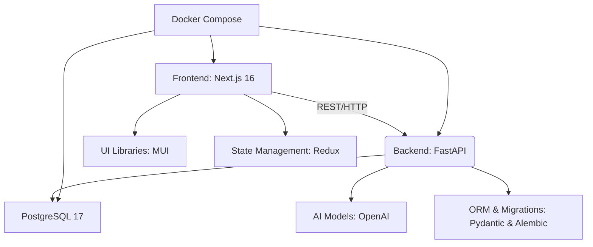

# Sparrow AI Builder

Sparrow AI Builder is a platform built for small and medium-sized businesses that want to automate routine operations without complex development. It enables companies to create, configure, and deploy AI-powered agents for sales, support, and internal workflow automation.

The platform boosts productivity, reduces operational costs, and helps teams handle repetitive tasks efficiently. It is suitable for online stores, service companies, agencies, startups, and digital teams. Business owners, managers, sales and support departments, and marketers use it to streamline operations and automate customer interactions. No in‑house IT team is required.

## Description

The system automates order processing, manages and screens job applicants, assists in selecting employees, tracks company KPIs, and monitors individual tasks and staff performance. AI capabilities are powered by OpenAI models, enabling natural language conversations, decision-making workflows, and optimized business processes.

## Tech Stack Overview

Below is a simplified architectural graph of the system components:



## Local Setup

### Frontend

1. Install dependencies:

```bash
npm install
```

2. Start the development server:

```bash
npm run dev
```

### Backend

Run backend and PostgreSQL using Docker Compose:

```bash
docker-compose up --build
```

This starts both FastAPI and PostgreSQL 17.

## Business Workflow

1. A business registers an account and creates its organization.
2. The company builds AI agents for sales or support tasks.
3. Each agent is configured according to business needs: workflows, tone, integrations.
4. Agents can be connected to:

    * WhatsApp Business
    * Instagram
    * Website chat bubble
5. Each agent collects data and generates analytics for KPI tracking.

## Example User Scenario

A customer writes to the company via WhatsApp. The AI sales agent handles the conversation, guides the customer through ordering, and processes the request.

If the customer has additional questions, the system transfers the chat to a support agent. The support agent continues the communication and resolves issues. This creates a consistent and automated customer communication flow across channels.
